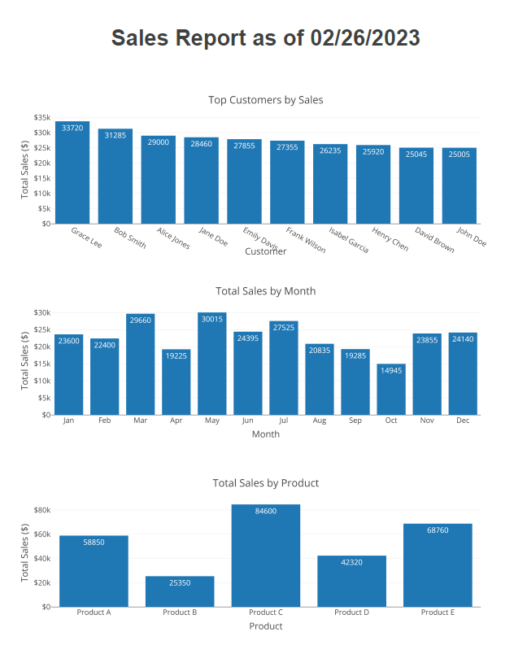

# Transform Your Data into Stunning PDF Reports with Python and SQL 📊
In this tutorial, I'll show you how to use Python and SQL to transform your data into stunning PDF reports. Whether you're an analyst, a business owner, or just looking to create professional-looking reports for your own use, this tutorial will guide you step-by-step through the process.

First, I'll show you how to set up a SQLite database and load sample data into it using Python. Next, I'll demonstrate how to use SQL queries to extract the data you need from the database. Then, I'll use Pandas to manipulate and transform the data, and show you how to create interactive charts with Plotly Express.

Once we have our data prepped and ready, I'll use the FPDF library to generate a beautiful PDF report.

Whether you're a beginner or an experienced Python user, this tutorial will give you the skills you need to create stunning PDF reports with ease. Follow along, and transform your data into stunning reports that will impress your audience!

## Database Schema

## PDF Output Example

